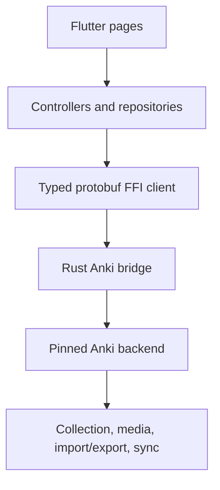

# AnkiFlutter core-parity design

## Goal

Deliver a single Flutter application for Linux, macOS, Windows, Android, and
iOS that uses the pinned official Anki Rust backend as the authority for
collection data, scheduling, search, rendering, media, and file formats.
The first public release optimizes for everyday Anki workflows rather than
desktop-only extension compatibility.

## Product boundary

The core-parity release includes:

- profile and collection lifecycle, recent collections, and safe recovery;
- deck hierarchy, creation, rename, delete, and study limits;
- note types, templates, fields, add/edit/duplicate-note handling, and tags;
- card browser search, sortable rows, selection, suspend/bury/delete, and
  bulk editing;
- scheduler-backed review, answer actions, undo, card rendering, media,
  audio, and TTS;
- `.anki2` collection access, `.apkg` import/export, collection media, and
  AnkiWeb-compatible sync when exposed by the pinned backend;
- responsive Flutter UI, native file selection/share integration, and desktop
  keyboard shortcuts.

The first release excludes arbitrary Anki desktop add-ons, Qt/Python plugin
execution, and a bundled server-side sync service. Those are separate future
projects; no compatibility claim is made for them.

## Architecture

Flutter owns navigation, presentation, local interaction state, accessibility,
and platform adapters. It must not duplicate collection, scheduling, search,
or card-rendering rules.

The Rust bridge is a small `cdylib`/static-library boundary around the pinned
Anki source. Operations are identified from generated descriptors, receive
protobuf request bytes, and return protobuf response bytes. The bridge owns
one active collection session per app instance and reports recoverable backend
errors with operation context.

Feature repositories convert generated protobufs to stable Dart domain models.
Pages depend on repository interfaces or controllers, enabling widget tests
without a native backend. Real-backend integration tests exercise the FFI path
against disposable collections.

## Platform model

One Dart package and one Rust bridge source tree are built for every target.
Linux, Windows, and macOS load the dynamic bridge; Android packages ABI-specific
shared libraries; iOS links the static bridge into the app. Platform code is
limited to library loading, file and share integration, notification/audio
adapters, and packaging scripts. A user-visible feature may be unavailable on
a platform only when the OS capability itself is absent; collection behavior
must stay the same.

## Data safety and errors

All destructive actions require explicit confirmation and surface the affected
item count. Collection close/open, import/export, and sync failures preserve
the last opened collection and show an actionable error. Imports stage to a
temporary location before replacing user-visible data. Media paths are served
only from the selected collection's media root.

## Milestones

1. **Platform foundation:** make the existing Rust bridge and CI green on all
   targets, with lifecycle and recovery coverage.
2. **Authoring parity:** finish note-type management, note editing, tags,
   templates, and deck-aware add flows.
3. **Browsing parity:** search grammar, selection/bulk actions, card and note
   editing, and browser persistence.
4. **Review parity:** scheduler controls, filtered/custom study, media,
   shortcuts, and statistics needed during ordinary study.
5. **Portability:** import/export, media transfer, sync capability, conflict
   handling, and migration/recovery tests.
6. **Release polish:** accessibility, responsive layouts, platform integration,
   onboarding, performance, and release artifacts.

Each milestone is independently testable and shipped as a reviewed PR. A
failing GitHub Actions build blocks merging that milestone.

## Verification

- Unit tests cover every repository mapping, controller transition, and error
  path.
- Widget tests cover each user workflow and platform capability fallback.
- Rust tests prove each exported operation and native buffer ownership.
- Integration tests create a disposable collection and verify add, search,
  edit, review, import/export, and media paths through real FFI.
- GitHub Actions runs protobuf drift checks, Rust formatting/lint/tests,
  Flutter analysis/tests, and Linux, Android, and iOS release builds after
  each meaningful PR update.

## Acceptance criteria

A user can create or open an Anki collection, create decks and notes, find and
edit cards, study with the official scheduler, undo actions, use attached
media, and import/export supported Anki packages from any supported platform.
The same collection produces equivalent backend results across platforms, and
all of the verification gates above are green on the merge commit.
